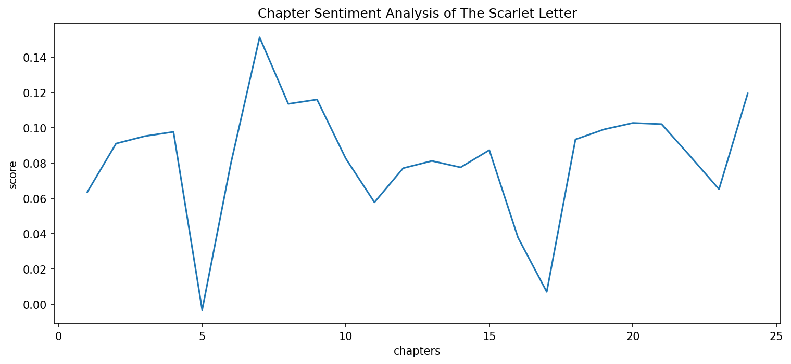
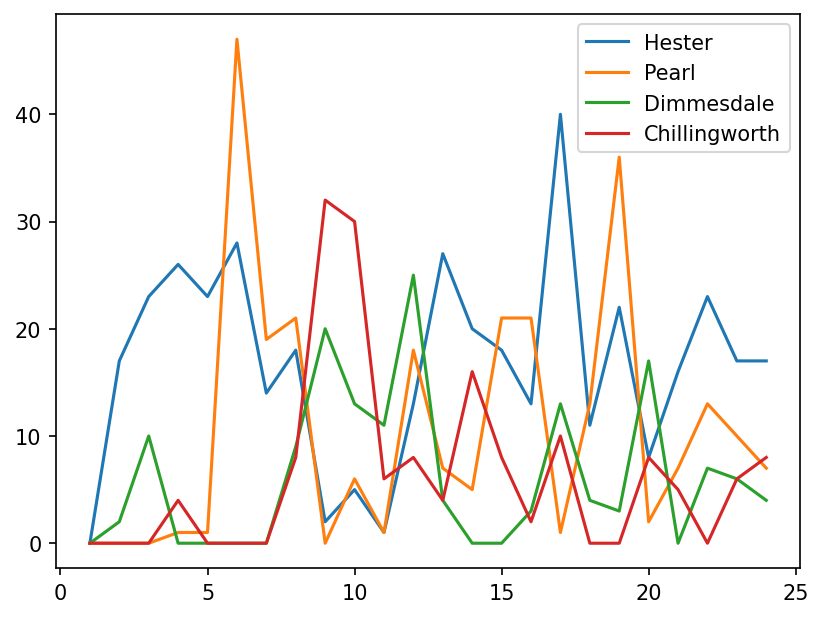
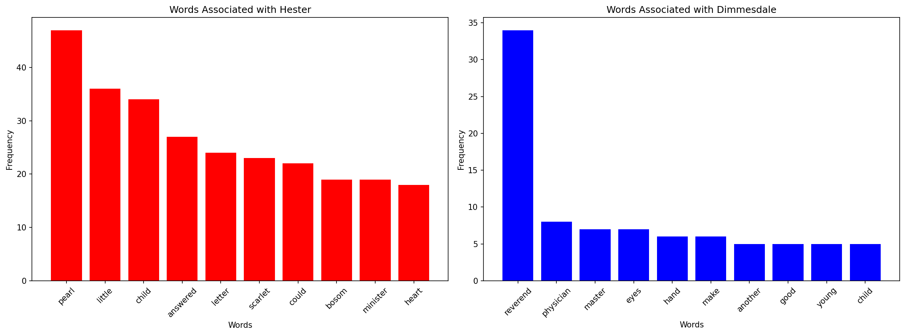

# The Scarlet Letter: An NLP Analysis

## Overview
NLP analysis of The Scarlet Letter exploring how Hawthorne writes male 
and female characters differently using sentiment analysis and collocate analysis.
Findings suggest that female characters are associated with emotion, motherhood and shame,
whereas male characters are associated with status and authority reflecting gender archetypes of
19th century Puritan society.

## Key Findings
- Hester is consistently surrounded by words of emotion, motherhood and shame, 
while Dimmesdale is framed by status and authority, reflecting 19th century 
Puritan gender archetypes.
- Pearl emerges as more central than expected — the other characters orbit 
around her like an oyster around a pearl.
- TextBlob sentiment analysis suggested limitations with 19th century prose — 
future work would benefit from a transformer-based model such as RoBERTa.

## Visualisations

### Sentiment Arc Across Chapters

### Character Mentions Across Chapters

### Words Associated with Hester vs Dimmesdale

## Techniques Used
- Sentiment Analysis (TextBlob)
- Collocate Analysis
- Co-occurrence Analysis
- Word Frequency Analysis

## Libraries
- Python, BeautifulSoup, NLTK, TextBlob, Matplotlib, WordCloud

## Data Source
- Project Gutenberg: The Scarlet Letter by Nathaniel Hawthorne
